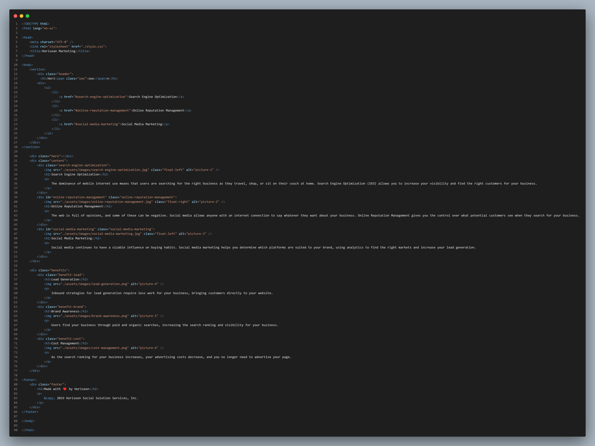
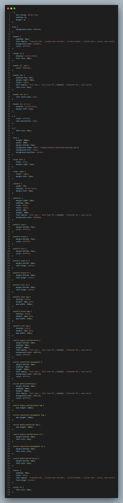

# Horisean1

 ## Description
    
    This assignment was a introductory challenge providing the opportunity to create and edit source code from an html and css file:
    
    - the motivation bhind this was to put my previously covered knowledge on styling objects to the test. After briefly covering topics on those languages, I was provided a starter code for this week's challenge. Through this activity I learned how to differentiate betwen certain psotioning styles, as well as css attributes, among a number of other commands. 
    
        
        
        
    
    